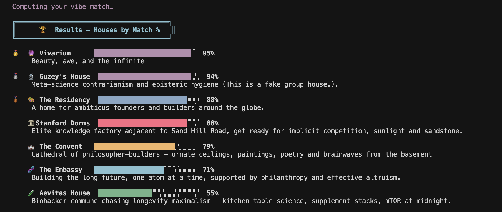

## SF sorting hat




## Try it out online
https://sort-yourselves.streamlit.app

---
## Try it out locally

## Requirements

- Python 3.9+
- `numpy`
- Internet connection (Datamuse API, free, no key needed)

## Quickstart

```bash
python3 -m venv .venv && source .venv/bin/activate
pip install numpy
python3 sorting_hat.py
```

---

## Features

- **10 questions**, each with 5 intriguing nouns to pick from
- **Adaptive from Q2+** — questions pivot toward the axis that separates your top-2 candidate houses
- **Greedy diversity sampling** — word choices are maximally spread across semantic space
- **PCA via SVD** — All houses are PCA decomposed across 15 axes and ranked, thus forming a 7×15 primitive-score matrix. We take the number of axes that explain the 93% of variance, sometimes this number of axes is 4, sometimes more.
- **Runtime word bank expansion** — Datamuse `rel_trg` queries add semantically related words at startup
- **Cosine similarity matching** — scores spread to 55–95% range for readable output
- **Pure stdlib + numpy** — no ML frameworks, no API keys

---

## Houses

| | House | Vibe |
|---|---|---|
| 🔮 | Vivarium | beauty, awe, imagination |
| 🎨 | The Residency | ambitious builders and founders in transit, o1 visa lollapalooza |
| 🧬 | The Embassy | frontier science, nanotechnology, long-termism, effective altruism |
| 🏛️ | Stanford Dorms | prestige, implicit competition, Sand Hill Road and sunshine |
| 🧪 | Aevitas House | biohacker commune, longevity maximalism |
| ⛪ | The Convent | hacker monasticism, philosophy, collective intelligence |
| 🔬 | Guzey's House | (fake house) meta-science contrarianism, epistemic hygiene |

---

## Data Flow

```
Startup
  ├── Load houses.json (N houses × 15 primitive scores + emoji, description, color)
  ├── Load 128-word local bank (each word scored in 15-D primitive space)
  ├── Datamuse API → fetch rel_trg words per primitive axis → expand bank
  └── SVD on N×15 house matrix → k PC axes (auto-labelled by top-loading primitives)

Per question
  ├── Q1–Q2: sample words via greedy farthest-first diversity
  ├── Q2+:   seed from word most aligned to discriminating direction (top-2 houses)
  └── User picks a word → accumulate answer vector

Result
  └── Cosine similarity: answer vector vs. each house's PC projection
      → ranked list, scores rescaled to 55–95%
```

---

# Contribute

## Adding Houses from hackermap.org

## Adding Your House

Edit **`houses.json`**: append one object to the **`houses`** array (order is the row order used for PCA).

- **`primitive_scores`** — 15 numbers, same order as **`primitive_axes`**, each in `0.0`–`1.0`.
- **`name`**, **`emoji`**, **`description`** — strings for the UI.
- **`terminal_color`** — bar color in the terminal: `red`, `yellow`, `green`, `cyan`, `blue`, or `pink`.

Example:

```json
{
  "name": "Your House Name",
  "emoji": "🏠",
  "terminal_color": "cyan",
  "description": "One evocative sentence about your house.",
  "primitive_scores": [0.8, 0.3, 0.5, 0.2, 0.6, 0.7, 0.4, 0.5, 0.2, 0.9, 0.6, 0.1, 0.4, 0.3, 0.5]
}
```

Do not change the length or order of **`primitive_axes`** unless you are intentionally redefining the model (and then re-score every house consistently).

> Real SF/NY/etc group houses are especially welcome to add themselves.

Inspired by parafactual.